## EP.01 | Dasymetrische Choroplethenkarten

Dieselben Einwohnerzahlen, drei Darstellungen: 3.913.644 Einwohner in 542 LOR-Planungsräumen. Die absolute Karte zeigt die Einwohner je Planungsraum, die relative die Einwohner je km² Gesamtfläche. Die dasymetrische Karte verteilt die Einwohner nur auf die tatsächlich bewohnten Blöcke des Umweltatlas und zeigt so, wo Berlin wirklich dicht besiedelt ist.

[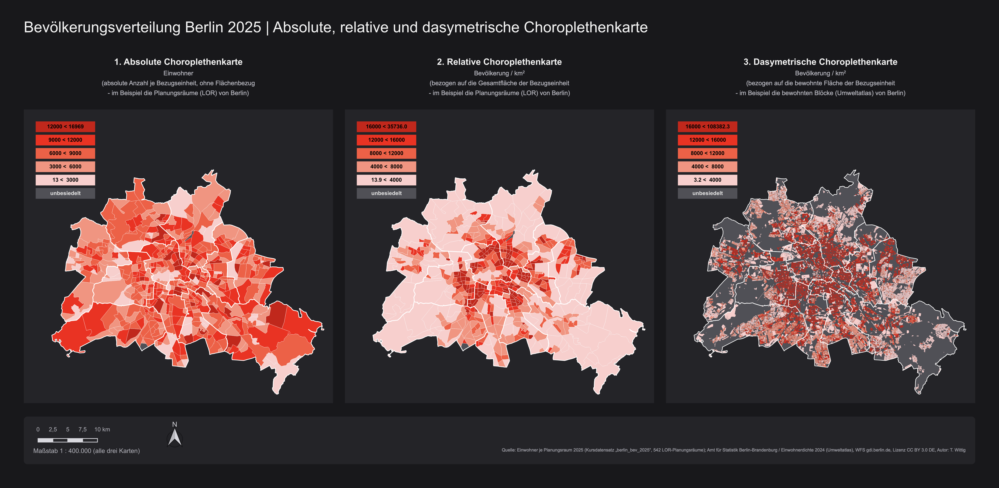](EP01_Bevoelkerungsverteilung_Berlin_2025.pdf)

## EP.02 | Gitterchoroplethenkarten

<a href="EP02_Kirschen_Berlin_Hexagon_500m.pdf">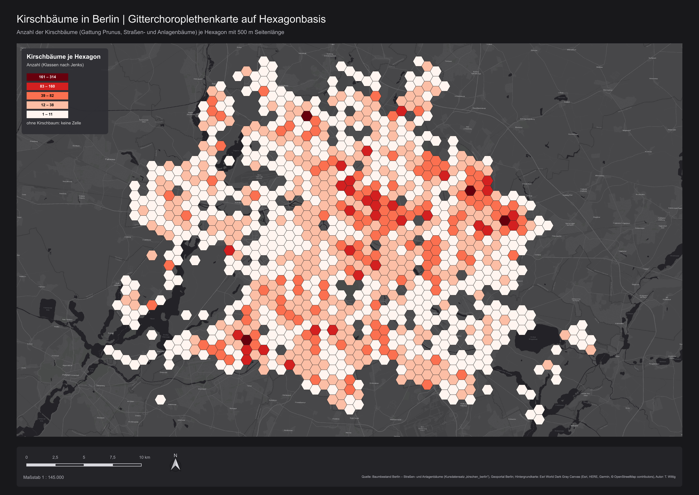</a>

21.622 Kirschbäume aus dem Berliner Straßen- und Anlagenbaumbestand (Gattung *Prunus*), gezählt in einem Hexagongitter mit 500 m Seitenlänge.

Zellen ohne Kirschbaum bleiben leer, dort scheint die Grundkarte durch.

 

## EP.03 | Punktrasterkarten

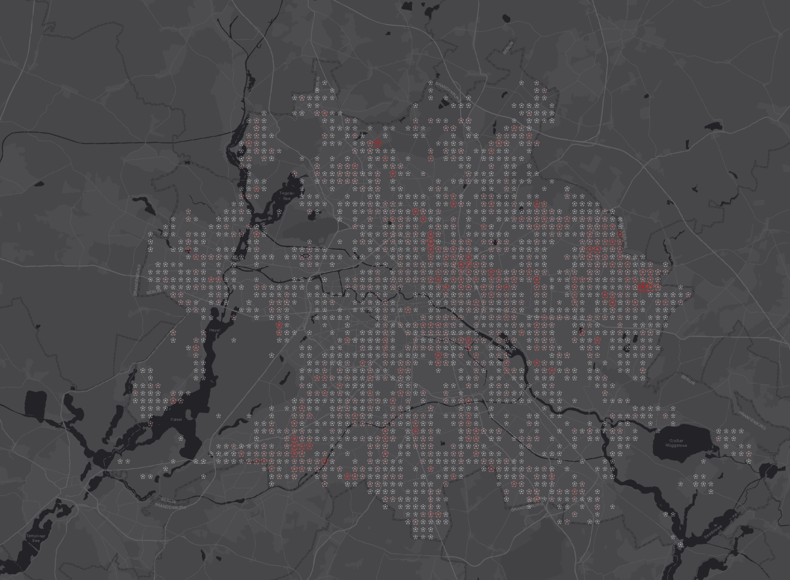

Dieselben Kirschbäume als Punktraster: Jeder Punkt eines regelmäßigen Rasters trägt eine Kirschblüte.

Größe und Farbe der Blüte wachsen mit der Anzahl der Bäume, von Weiß bis Rot.

 

## EP.04 | Value-By-Alpha-Mapping

Die Parlamentswahl in Ungarn 2026 in den 106 Wahlkreisen. Die Hauptkarte färbt jeden Wahlkreis nach dem Gewinner und stuft die Farbe nach dessen Stimmanteil ab: Tisza gewinnt 96 Direktmandate, Fidesz-KDNP 10. Dazu kommen ein Ausschnitt für Budapest, die Sitzverteilung der Parteilisten (45 / 42 / 6) und je eine Choroplethenkarte der Stimmanteile beider Parteien.

[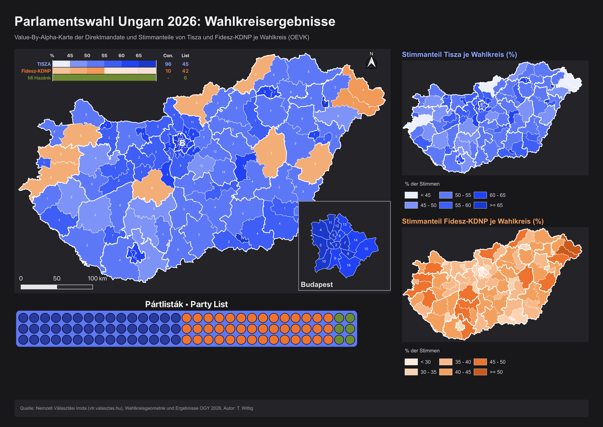](EP04_Ungarn_Wahlen_2026_Value-By-Alpha.pdf)

## EP.05 | Ursprung-Ziel-Karten

<a href="EP05_Flowmap_BHT_Incoming_2024.pdf">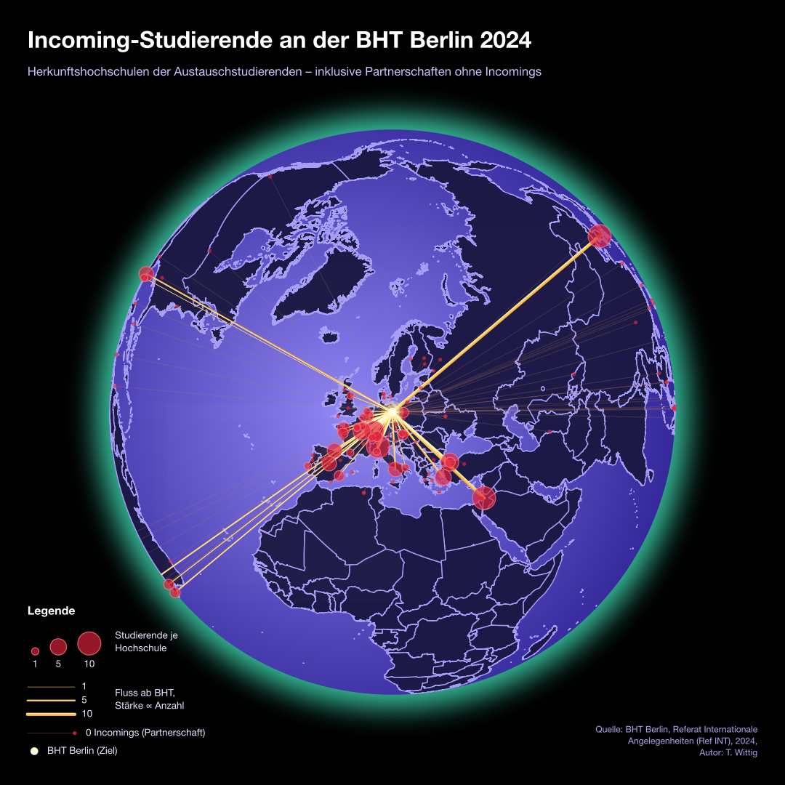</a>

Woher kommen die Austauschstudierenden der BHT?

Die 111 Incomings des Jahres 2024 als Großkreise auf einem Globus mit Berlin im Zentrum. Linienstärke und Kreisgröße wachsen mit der Anzahl der Studierenden. Dünne braune Linien führen zu Partnerhochschulen ohne Incomings.

 

## EP.06 | Tilemaps

Das Relief im Lego-Stil: Jede Rasterzelle ist ein Legostein, die Farbe zeigt ihre mittlere Geländehöhe.

<table>
  <tr>
    <td valign="top" width="62%">
      <a href="EP06_Lego_Relief_Berlin_A3.pdf">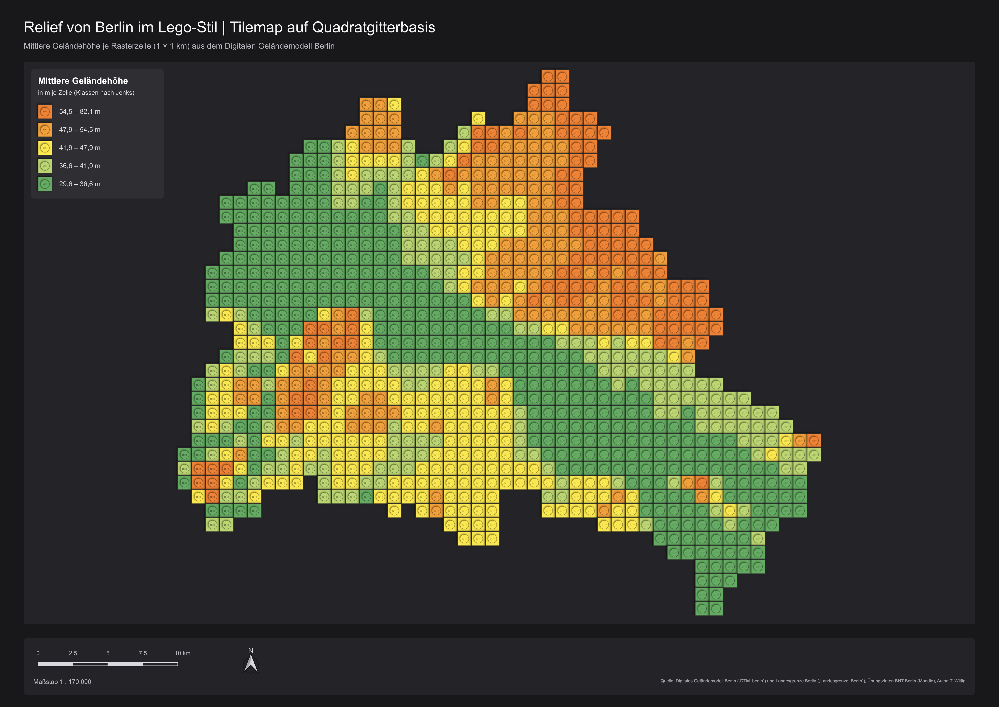</a>
      
<b>Berlin</b> 1 × 1 km-Zellen aus dem Digitalen Geländemodell Berlin, von 29,6 m bis 82,1 m.

    </td>
    <td valign="top" width="38%">
      <a href="EP06_Lego_Relief_Deutschland_A3.pdf">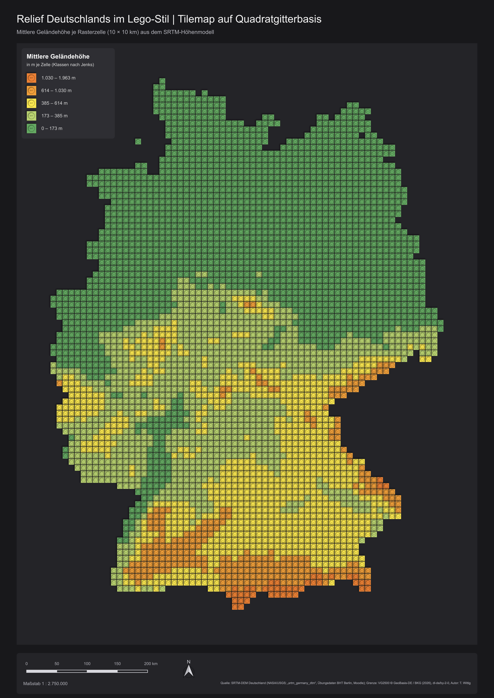</a>
      
<b>Deutschland</b> 3.860 Steine mit 10 × 10 km aus dem SRTM-Höhenmodell, von der Küste bis in die Alpen.

    </td>
  </tr>
</table>

## EP.07 | Animation in QGIS

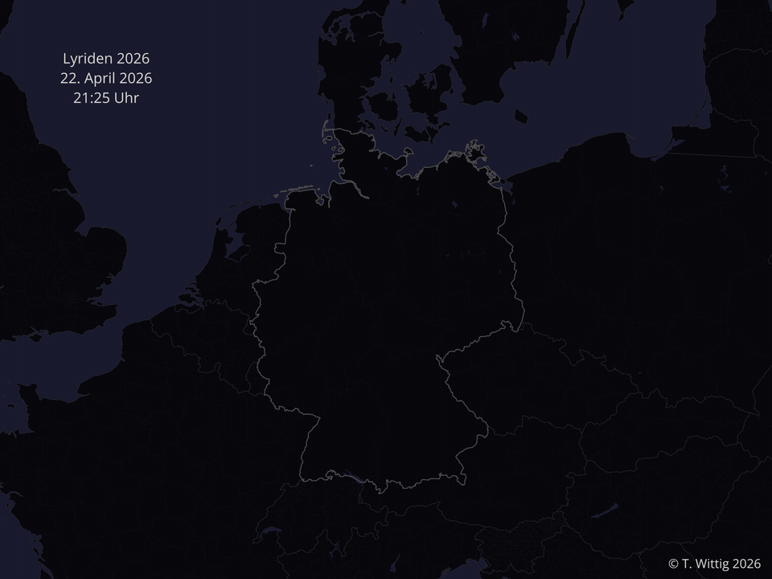

Die Lyriden in der Nacht vom 22. auf den 23. April 2026, von 21:25 bis 05:14 Uhr MESZ.

291 Meteore aus dem Global Meteor Network, erfasst von Kameras in Deutschland und einer Station in Tschechien. Jeder Meteor fliegt entlang seiner gemessenen Bahn und glimmt danach kurz nach.

 

## EP.08 | Mesh-Daten

Orkan Kyrill vom 16. bis 21. Januar 2007 im Stil von van Gogh: ERA5-Winddaten (10 m über Grund, 0,25°-Gitter) als Mesh-Layer, dargestellt als Stromlinien und in 3-Stunden-Schritten animiert. Die Farbe zeigt die Windgeschwindigkeit von 0 bis über 25 m/s.

  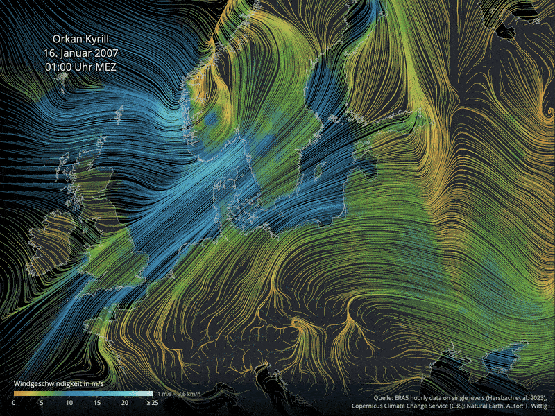

## EP.09 | 3D-Gebäudemodelle

Die LoD2-Gebäudemodelle Thüringens rund um den Erfurter Dom, einmal als 2,5D-Ansicht und einmal als echte 3D-Szene.

<table>
  <tr>
    <td valign="top" width="50%">
      <a href="EP09_Erfurt_Domplatz_2_5D.pdf">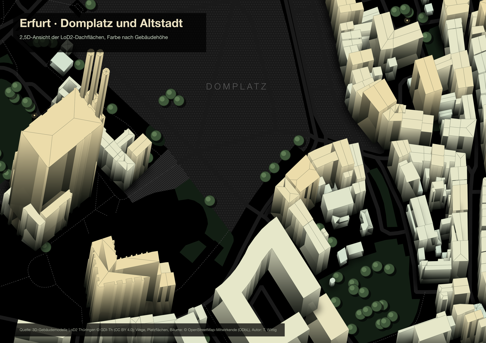</a>
      
<b>2,5D · Domplatz und Altstadt</b> Die Dachfarbe wird mit der Gebäudehöhe wärmer. Platzflächen, Domstufen und Bäume stammen aus OpenStreetMap.

    </td>
    <td valign="top" width="50%">
      <a href="EP09_Erfurt_Dom_3D.pdf">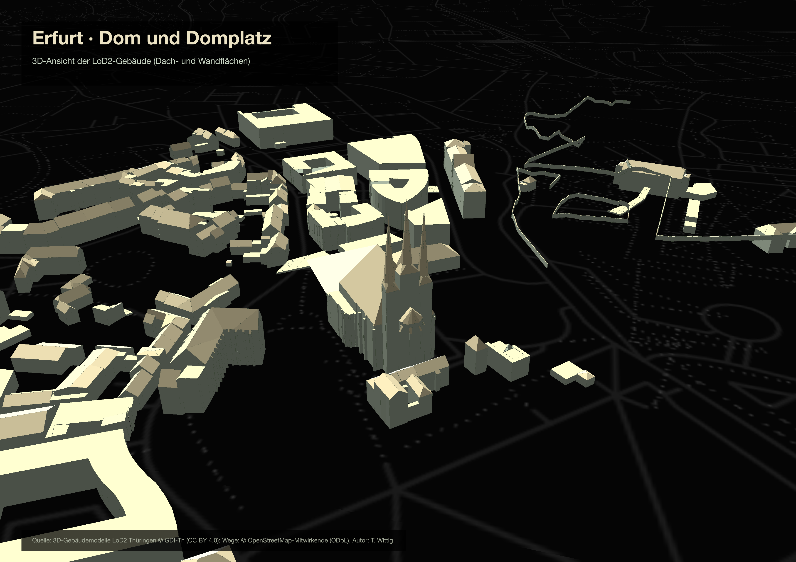</a>
      
<b>3D · Dom und Domplatz</b> Die Szene ist aus den Dach- und Wandflächen der LoD2-Modelle aufgebaut.

    </td>
  </tr>
</table>
